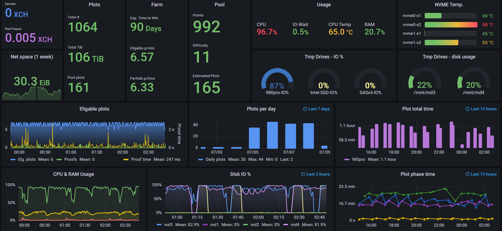

# chia-monitor
Monitor your Chia farming & plotting using [Telegraf](https://github.com/influxdata/telegraf), [InfluxDB](https://github.com/influxdata/influxdb) and [Grafana](https://github.com/grafana/grafana).
Available Telegraf plugins can found [here](https://docs.influxdata.com/telegraf/v1.19/plugins/)

In my case, I already had InfluxDB & Grafana as part of my [Home-Assistant](https://www.home-assistant.io/) setup, running on Raspberry Pi 4. But this can be installed on any Windows or Linux machine.

Check out my [Dashboard overview video](https://youtu.be/SZ7zhTrNbyo)

Windows installation: [Telegraf](https://docs.influxdata.com/telegraf/v1.19/introduction/installation/?t=Windows) | [InfluxDB](https://docs.influxdata.com/influxdb/v2.0/install/?t=Windows) | [Grafana](https://grafana.com/docs/grafana/latest/installation/windows/)

Linux installation: [Telegraf](https://docs.influxdata.com/telegraf/v1.19/introduction/installation/) | [InfluxDB](https://docs.influxdata.com/influxdb/v2.0/install/?t=Linux) | [Grafana](https://grafana.com/docs/grafana/latest/installation/debian/)

Dashboard:

